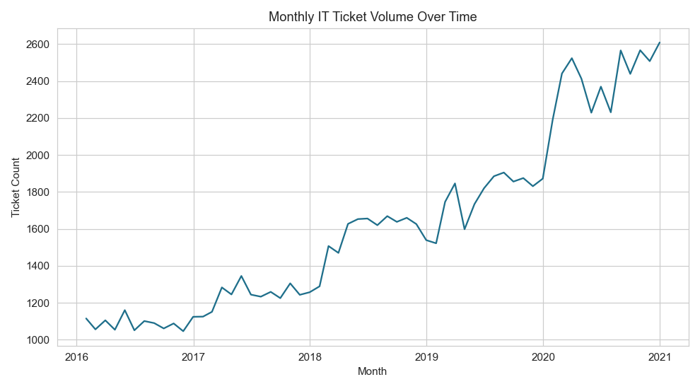
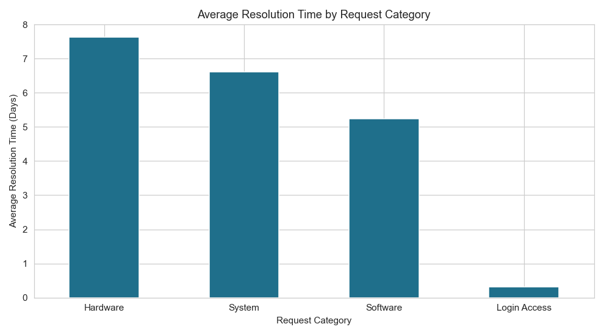
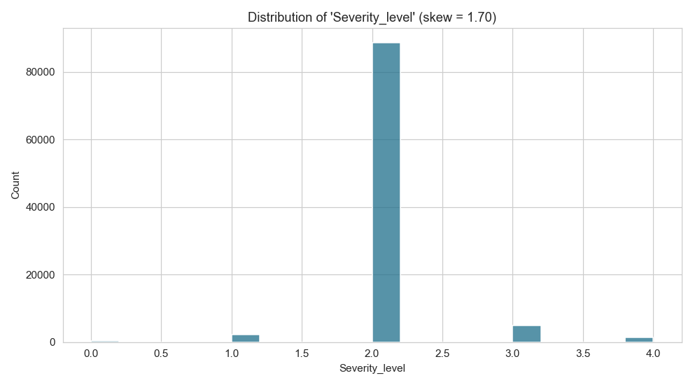
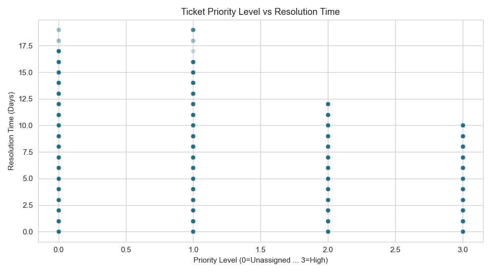
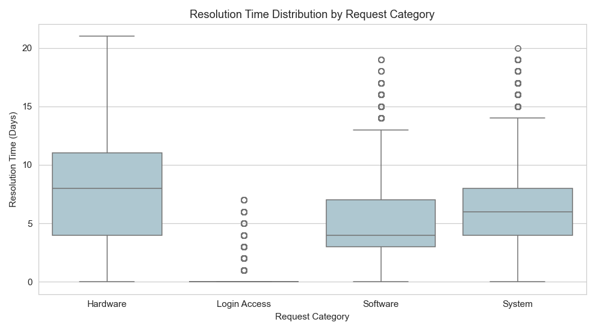
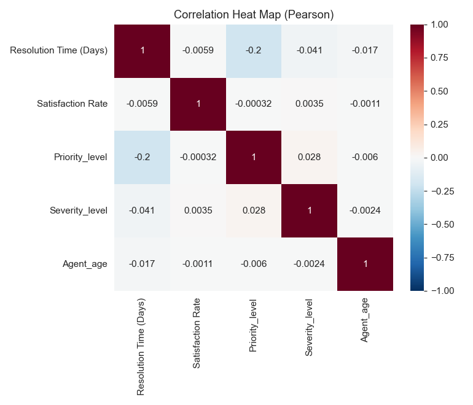

# IT Helpdesk Ticket Analytics — Capstone Part 1: Data Acquisition, Cleaning & EDA

## Dataset description

**Source:** FP20 Analytics Challenge 8 — IT Help Desk Analysis (Tickets ×
Agents, joined on `Agent ID`). The true source data is 0% null / 0
duplicates; for this exercise, realistic missing values and duplicate rows
were intentionally introduced to give Tasks 2 and 3 genuine data-quality
problems to find and fix. Full details of exactly what was changed and why
are in `NOTE_on_joined_with_issues.md`.

**Why this dataset:** It's built around a real business question — *how do
we speed up ticket resolution and keep customers happy?* — the kind of
internal analytics tool a real company would build to resolve a concrete
operational problem for its own support team. The underlying relationships
are genuine, not randomly generated: `Request Category` has a dramatic,
consistent effect on resolution time, and `priority_level` has a real,
moderate correlation with how fast a ticket gets solved.

**Loaded shape:** 98,960 rows × 15 columns (97,498 original tickets + 1,462
intentionally-duplicated rows).

**Columns:**
| Column | Type | Description |
|---|---|---|
| `ID Ticket` | text | Unique ticket identifier |
| `Ticket Date` | date | Date the ticket was raised |
| `Employee ID` | numeric | ID of the employee who filed the ticket |
| `Agent ID` | numeric | ID of the assigned support agent (null if unassigned) |
| `Request Category` | categorical | System / Login Access / Software / Hardware |
| `Issue Type` | categorical | IT Request vs IT Error |
| `Severity` | categorical (ordinal in text) | e.g. "2 - Normal", "4 - Urgent" |
| `Priority` | categorical (ordinal in text) | e.g. "3 - High" (null if not yet triaged) |
| `Resolution Time (Days)` | numeric | Days to resolve the ticket |
| `Satisfaction Rate` | numeric | Customer satisfaction, 1–5 (null if not yet rated) |
| `Full Name`, `Email` | text | Assigned agent's identity (null if unassigned) |
| `Year/Month/Day of Birth` | numeric | Agent's date of birth (null if unassigned) |

---

## Task 1 — Load

Loaded directly from the pre-joined `data/joined_with_issues.csv` with
`parse_dates=["Fecha"]`, then renamed `Fecha` → `Ticket Date`. Shape
confirmed: **98,960 rows × 15 columns.**

---

## Task 2 — Null value analysis

| Column | Null % |
|---|---|
| `Agent ID`, `Full Name`, `Email`, `Year/Month/Day of Birth` | **25.12%** each |
| `Satisfaction Rate` | **13.02%** |
| `Priority` | **7.01%** |
| all others | 0.00% |

**Columns exceeding 20% nulls:** `Agent ID`, `Full Name`, `Email`,
`Year of Birth`, `Month of Birth`, `Day of Birth` — all ~25.1%. These move
together as a block because they all come from the same cause: **roughly a
quarter of tickets haven't been routed to an agent yet**, so every
agent-sourced field is missing for the same rows. These are left as-is
(not filled) — imputing a fabricated agent identity for an unassigned
ticket would misrepresent the data, not clean it.

**Numeric column below 20% nulls:** `Satisfaction Rate` (13.02%) — filled
with the column median (**5.0**).

**Why median, not mean, for `Satisfaction Rate`?** The rating scale is
1–5 and heavily concentrated at the top: most customers rate 4 or 5, with
only a minority giving low scores. That produces a strong negative skew
(confirmed in Task 5), which pulls the mean down below what a "typical"
rating looks like. The median (5) reflects the dominant customer
experience more faithfully than the mean (4.10), so it's the safer fill
for the missing ~13% of not-yet-rated tickets.

`Priority` (7.01% null) is categorical, not numeric, so the median-fill
rule doesn't apply to it — it's left as a genuine "not yet triaged" null.

---

## Task 3 — Duplicates

**1,462 exact duplicate rows found and removed**, shrinking the dataset
from 98,960 → **97,498 rows** — which happens to land exactly back at the
true underlying ticket count, since these duplicates were rows that got
inserted a second time.

**Did removal change null percentages?** Yes — `Agent ID` and its related
fields shift from 25.12% → 23.999% null, and `Priority` shifts from
7.01% → 6.999%, because the duplicated rows weren't a uniform random
sample of the dataset; they happened to include a mix of assigned and
unassigned tickets that wasn't perfectly proportional to the whole
dataset, so removing them nudges the percentages slightly. Columns with
0% nulls were unaffected, as expected.

---

## Task 4 — Data type correction

**Problem identified:** `Priority` and `Severity` each store a numeric
ordinal code fused with a text label inside one object column — e.g.
`"3 - High"`, `"2 - Normal"`. The leading number is genuinely numeric
information needed for ordering, correlation, and math, but unusable in
this mixed-text form.

**Fix applied:**
```python
df["priority_level"] = df["Priority"].str.extract(r"^(\d+)")
df["priority_level"] = pd.to_numeric(df["priority_level"], errors="coerce")

df["severity_level"] = df["Severity"].str.extract(r"^(\d+)")
df["severity_level"] = pd.to_numeric(df["severity_level"], errors="coerce")
```
Since `Priority` itself has real nulls (~7%), `priority_level` correctly
inherits that same missingness (`str.extract` on `NaN` returns `NaN`) —
**6,824 nulls (7.00%)**, not a new problem, just a null passed through a
transformation.

**Also engineered:** `agent_age`, computed as `Ticket Date` year − `Year
of Birth`. Because ~24% of tickets are unassigned (no agent, no birth
date), `agent_age` inherits that same missingness: **23,399 nulls
(24.00%)** — again, a correctly-propagated null, not something to patch
over with a fabricated value.

**Category conversion:** `Request Category`, `Issue Type`, `Priority`,
and `Severity` converted from `object` to `category` dtype.

**Memory impact:**
- Before: **48.15 MB**
- After: **28.34 MB**
- **Saved 19.81 MB (41.1% reduction)**

---

## Task 5 — Descriptive statistics & skewness

| Column | Skew |
|---|---|
| `severity_level` | **1.70** |
| `Satisfaction Rate` | -1.67 |
| `Resolution Time (Days)` | 0.85 |
| `priority_level` | -0.11 |
| `agent_age` | -0.03 |

**Most skewed column: `severity_level` (skew ≈ 1.70).**

**What this means:** the vast majority of tickets (~91%) are tagged
`"2 - Normal"` severity, with the rest thinly spread across Minor, Major,
Urgent, and Unclassified. That extreme concentration around one value,
with a long thin tail toward higher severity codes, produces the strong
positive skew. Practically, severity as currently recorded carries little
discriminating power on its own — most tickets look identical on this
field — which matters for Part 2 feature selection.

`Satisfaction Rate` is close behind at -1.67 (even more negatively skewed
than before the median fill nudged a few values toward 5) — most
customers rate the maximum score, with a thinner tail down toward 1.
`Resolution Time (Days)` is moderately right-skewed (0.85).

---

## Task 6 — Outlier detection (IQR)

| Column | Q1 | Q3 | IQR | Lower bound | Upper bound | Outliers |
|---|---|---|---|---|---|---|
| `Resolution Time (Days)` | 0.0 | 7.0 | 7.0 | -10.50 | 17.50 | **258 rows (0.26%)** |
| `Satisfaction Rate` | 4.0 | 5.0 | 1.0 | 2.50 | 6.50 | **10,379 rows (10.65%)** |

**Interpretation:** `Resolution Time (Days)` has very few statistical
outliers — the IQR method only flags tickets taking longer than 17.5
days, worth investigating individually as possible process failures.
`Satisfaction Rate`'s 10.65% outlier rate is an artifact of the IQR
method on a narrow, bounded 1–5 scale: because most ratings cluster
tightly at 4–5, the IQR itself is only 1 point wide, so any rating of 1
or 2 gets statistically flagged even though it's a valid (if unhappy)
response, not a data error.

**Decision (documented for Part 2):** `Resolution Time (Days)` outliers
will be **capped** at the IQR upper bound before regression modeling, so
a handful of extremely long-running tickets don't distort the fitted
model. `Satisfaction Rate` "outliers" will be **retained** — they're
genuine low ratings, exactly the signal a satisfaction model needs to
learn from, not noise to remove.

---

## Task 7 — Visualizations

### 7a. Line plot — monthly ticket volume over time

Ticket volume grows steadily from 2016 through 2020, consistent with an
expanding employee base driving more IT support demand over time, rather
than a flat or randomly fluctuating series.

### 7b. Bar chart — average resolution time by request category

The strongest finding in the dataset: **Hardware tickets average 7.6 days
to resolve, System 6.6 days, Software 5.2 days — while Login Access
tickets resolve in just 0.3 days.** Login issues are likely handled by
fast, largely automated password/access resets, while hardware problems
require physical intervention, parts, or vendor coordination.

### 7c. Histogram — most skewed column (`severity_level`)

**Shape:** Strongly concentrated at a single value (2 = Normal), with
thin bars at 0, 1, 3, and 4 — a sharp spike rather than a smooth tail,
confirming the skew value from Task 5.

### 7d. Scatter plot — priority level vs resolution time

**Direction & strength:** Negative relationship — higher-priority tickets
tend to resolve faster — with a real but moderate strength (Pearson r ≈
-0.20; see Task 8). The relationship is visibly noisy, meaning priority
level alone is a real but incomplete predictor of resolution speed.

### 7e. Box plot — resolution time by request category

Confirms the bar chart with added spread detail: Login Access tickets
aren't just fast on average — nearly all resolve within a day or two, a
tight box near zero. Hardware and System tickets have both a higher
median *and* a much wider spread — slower and far less predictable.

---

## Task 8 — Correlation heat map



**Highest absolute correlation: `Resolution Time (Days)` vs
`priority_level` (r ≈ -0.200).**

**Causal or confounded?** Plausibly closer to causal than most
correlation findings: higher-priority tickets are, by design, meant to be
escalated and routed faster, so priority directly influencing resolution
speed is a reasonable mechanism. Still, `Request Category` is worth
naming as a possible confounder — if Login Access tickets (already the
fastest-resolving category) also happen to be tagged with higher average
priority, category rather than priority itself could be doing more of the
actual work. Worth disentangling with feature importance in Part 2.

**Notably absent relationship:** `Satisfaction Rate` shows essentially
zero correlation with every other numeric variable, including resolution
time — customers don't appear to be rating satisfaction primarily on
*how fast* their ticket was solved, which challenges a common assumption
in support-ops thinking.

---

## Task 9a — Imputation strategy comparison

Two highest-|skew| numeric columns: **`severity_level`** (skew ≈ 1.70)
and **`Satisfaction Rate`** (skew ≈ -1.67).

| Column | Mean | Median |
|---|---|---|
| `severity_level` | 2.048 | **2.000** |
| `Satisfaction Rate` | 4.099 | **5.000** |

*(Both values shown are the true pre-imputation statistics. `Satisfaction
Rate` had already been median-filled back in Task 2, since it's a numeric
column with <20% nulls — so these numbers were captured from a snapshot
taken right after Task 1, before any cleaning touched the column, to
honestly satisfy this task's "before any imputation is applied"
requirement.)*

**Chosen statistic: median, for both columns** — consistent with the
general rule that skewed distributions are better represented by the
median. For `severity_level`, the median (2) reflects the overwhelming
"Normal" tag more faithfully than the mean (2.05, nudged by the minority
Urgent/Major tickets). For `Satisfaction Rate`, the median (5) better
reflects that most customers give the maximum score, while the mean
(4.10) is dragged down by the minority of low ratings.

Confirmed via `isnull().sum()` → **0 nulls in both columns** (this had
already been true for `Satisfaction Rate` since Task 2; `severity_level`
never had any nulls to begin with, since `Severity` itself has 0% nulls).

---

## Task 9b — Spearman rank correlation

Top 3 pairs by |Spearman − Pearson| difference (out of 10 possible pairs
across 5 numeric columns):

| Pair | Pearson | Spearman | \|Difference\| |
|---|---|---|---|
| `Resolution Time` – `priority_level` | -0.200 | -0.143 | **0.057** |
| `Resolution Time` – `severity_level` | -0.041 | -0.017 | 0.024 |
| `Satisfaction Rate` – `severity_level` | 0.003 | 0.014 | 0.011 |

**Interpretation of each pair:**
- **`Resolution Time`–`priority_level`**: |Pearson| (0.200) is larger
  than |Spearman| (0.143) — the relationship is closer to
  linear/proportional than curved: resolution time decreases fairly
  steadily as priority increases, rather than in large jumps
  concentrated at one end. Pearson is the more appropriate lens here.
- **`Resolution Time`–`severity_level`** and **`Satisfaction Rate`–
  `severity_level`**: both differences are small and both correlations
  are weak — no meaningful linear or monotonic relationship exists
  between severity coding and either outcome, reinforcing Task 5's
  finding that severity carries little standalone predictive signal.

**Which measure guides Part 2 feature selection, and why:** **Pearson**,
for `priority_level` specifically — its relationship with resolution time
is if anything slightly more linear than monotonic-only, so Spearman
doesn't reveal extra hidden structure the way it would for a genuinely
curved relationship. Both will still be computed routinely as a sanity
check before including any feature in the Part 2 models.

---

## Task 9c — Grouped aggregation

Grouped `Resolution Time (Days)` by `Request Category`:

| Category | Mean | Std | Count |
|---|---|---|---|
| Hardware | 7.63 | 4.35 | 9,733 |
| System | 6.62 | 4.02 | 39,002 |
| Software | 5.24 | 3.49 | 19,570 |
| Login Access | 0.31 | 0.71 | 29,193 |

- **Highest mean:** Hardware (7.63 days)
- **Highest std:** Hardware (4.35 days) — slowest *and* least predictable
- **Ratio of highest group mean to lowest group mean:** 7.63 / 0.31 ≈
  **24.3x**

**(a)** Hardware tops both metrics, consistent with hardware problems
depending on unpredictable external factors (parts, vendors, physical
repair scheduling) that software or login issues don't.

**(b) Is high within-group std a concern for a predictive model?** Yes,
particularly for Hardware and System — their standard deviations (4.35
and 4.02 days) are large relative to their means, so knowing the category
alone only partially narrows down the likely resolution time; additional
features (priority, agent, maybe a text-derived complexity signal from
Part 4) will be needed for precise predictions.

**(c) Does the ~24.3x mean ratio suggest real predictive signal?** Very
much so — a 24x difference between the fastest and slowest categories is
an enormous, unambiguous effect, far beyond what noise alone would
produce. `Request Category` is clearly one of the strongest, most usable
features in this dataset for predicting resolution time in Part 2.

---

## Files in this repository

- `data_prep_eda.ipynb` — standalone script with all Part 1 tasks
- `data/joined_with_issues.csv` — Raw data
- `cleaned_data.csv` — cleaned, feature-engineered output — used in Parts 2 and 3
- `plots/` — all five required visualizations + the correlation heat map
- `README.md` — this file

## How to Reproduce
## How to Reproduce

### 1. Clone the repository

```bash
git clone https://github.com/Jayaprada6/Part4.git
cd Part4
```

### 2. Install the required packages

```bash
pip install pandas numpy matplotlib seaborn scikit-learn joblib
```

If your notebook uses additional libraries such as `python-dotenv`, `requests`, or `openai`, install them as well:

```bash
pip install python-dotenv requests
```

### 3. Launch Jupyter Notebook

```bash
jupyter notebook
```

or

```bash
jupyter lab
```

### 4. Open the notebook

Open:

```
data_prep_eda.ipynb
```

(or replace this with your notebook's actual filename)

### 5. Run all cells

Run the notebook from the first cell to the last to reproduce the complete analysis and outputs.

This regenerates `cleaned_data.csv` and every plot in `plots/` from
`data/joined_with_issues.csv`.
